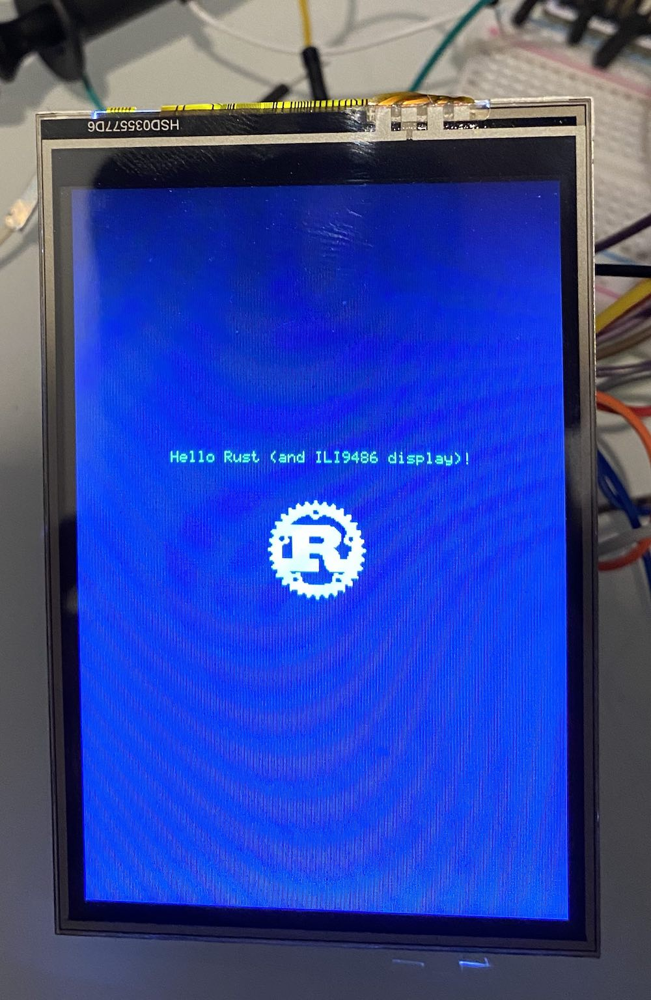

# ILI9486 driver for Rust

 

This crate contains a driver for the ILI9486 LCD controller.

See the [full example](examples/full.rs) for usage, or check out the documentation.




## Usage

This crate is not yet published, but you can stil try it out.

Add the following to your `Cargo.toml`:

```toml
ili9486-driver = {git = "https://github.com/chrismoos/ili9486-driver", branch = "master"}
```

## Tasks

- [x] GPIO 8-bit Parallel Interface
- [ ] GPIO 16-bit Parallel Interface (Needs testing)
- [ ] GPIO 18-bit Parallel Interface (Needs testing)
- [ ] Serial Interface (3 and 4-wire)

## I/O Pin

To facilitate both read and writes on the same pin, there is a [local implementation](./src/io/mod.rs) of the `IoPin` concept in this crate, which will be eliminated later once [this issue](https://github.com/rust-embedded/embedded-hal/issues/29) on `embedded-hal` is resolved.

For now, there is a shim, `OutputOnlyIoPin` that you can use to create an `IoPin` from a single `OutputPin`:

```rust
let pa5 = OutputOnlyIoPin::new(gpioa.pa5.into_push_pull_output(&mut gpioa.crl));
```

## Devices

Tested on the following devices:

* STM32F1xx

## Benchmark

The **Fill Screen** benchmark draws a rectangle covering the whole screen with a solid color:

```rust
let mut start = elapsed_millis();
Rectangle::new(Point::new(0, 0), Point::new(320, 480))
    .into_styled(
        PrimitiveStyleBuilder::new()
            .fill_color(Rgb888::CYAN)
            .build(),
    )
    .draw(&mut lcd_driver)
    .unwrap();
let screen_fill_rect = elapsed_millis() - start;
```

### Results

|Device|Interface|Color Mode|Fill Screen (ms)|Pixel Rate/s|
|------|---------|--------|---------|------|
|STM32F103RB (72Mhz)|GPIO 8-Bit|RGB 5-6-5|250ms|1,228,800|

## Example

Setup the LCD with the 8-bit parallel interface, and draw some text and an image. See this whole example [here](./examples/output_only.rs).

```rust
let parallel_gpio =
    GPIO8ParallelInterface::new(pa5, pa6, pa7, pa8, pa9, pa10, pc7, pb10, pb6, pb8, pb7, pb9)
        .unwrap();
let mut lcd_driver = ILI9486::new(&mut delay, PixelFormat::Rgb565, parallel_gpio, pb5).unwrap();

// reset
lcd_driver.write_command(0x01, &[]).unwrap();
lcd_driver.write_command(0x11, &[]).unwrap();

lcd_driver.write_command(0x20, &[]).unwrap();

// MADCTL settings
lcd_driver.write_command(0x36, &[0b10001000]).unwrap();

lcd_driver.clear_screen().unwrap();

// turn on display
lcd_driver.write_command(0x13, &[]).unwrap();
lcd_driver.write_command(0x29, &[]).unwrap();
lcd_driver.write_command(0x38, &[]).unwrap();

let t = Text::new("Hello Rust (and ILI9486 display)!", Point::new(64, 175))
    .into_styled(TextStyle::new(Font6x8, Rgb888::GREEN));

t.draw(&mut lcd_driver).unwrap();

let tga = Tga::from_slice(include_bytes!("../test/rust-rle-bw-topleft.tga")).unwrap();

let image: Image<Tga, Rgb888> = Image::new(
    &tga,
    Point::new(
        (320 / 2 - (tga.width() / 2)) as i32,
        ((350 / 2 - (tga.height() / 2)) + 64) as i32,
    ),
);

image.draw(&mut lcd_driver).unwrap();
```

## License

This project uses the Apache License, Version 2.0 (LICENSE-APACHE or http://www.apache.org/licenses/LICENSE-2.0).